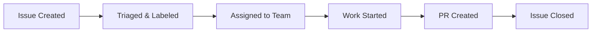
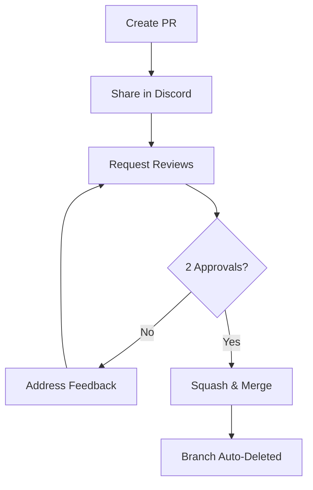

<div align="center">


# Contributing Guidelines

> Thank you for your interest in contributing to Beastly Brawl Showdown!

We welcome contributions of all kinds — from bug fixes and new features to documentation and design improvements.

</div>

---

## 📑 Table of Contents

- [Commits](#-commits)
- [Branching Strategy](#-branching-strategy)
  - [Main Branch](#main-branch)
  - [Feature Branches](#feature-branches)
  - [Feature Sub-Branches](#feature-sub-branches)
- [Issues](#-issues)
- [Pull Requests](#-pull-requests)
- [Quick Reference](#-quick-reference)

---

## 📝 Commits

### Commit Guidelines

Members should commit after any work is done. Use your own judgment to decide when to commit.

### Commit Message Format

The first line of the commit should follow this format:

```
branchID: message
```

**Example:**

```
1001: Add defender monster
```

### Extended Commit Messages

Commits can also include further comments about changes made:

```
1001: Add defender monster
- Created a defender monster that extends from Monster class
- Added special defensive ability
- Updated unit tests
```

> [!IMPORTANT]
>
> Write clear, descriptive commit messages that explain **what** changed and **why**. This helps reviewers and future developers understand your work.

---

## 🌿 Branching Strategy

### Main Branch

> [!CAUTION]
>
> The `main` branch is **protected** and cannot be directly edited.

#### Key Rules

- ✅ All work must be performed in feature branches (or feature sub-branches)
- ✅ Merges to `main` require a Pull Request with 2 approvals
- ✅ Only shippable/deployable software should be in `main`
- ✅ Branch owner must manually squash and merge (this deletes the original branch)

### Feature Branches

#### Naming Convention

```
task/ID-featureName
```

| Component       | Description                                           | Example             |
| --------------- | ----------------------------------------------------- | ------------------- |
| **task**        | Type of work (`feature`, `bugfix`, `docs`, `testing`) | `feature`           |
| **ID**          | Team digit (1st) + incremental number (next 3 digits) | `1003`              |
| **featureName** | Descriptive name with hyphens separating words        | `monster-selection` |

#### Team ID Prefixes

| Team       | First Digit | Example IDs         |
| ---------- | ----------- | ------------------- |
| Team Cobra | `1`         | 1000, 1001, 1002... |
| Team Rhino | `2`         | 2000, 2001, 2002... |
| Team Pogo  | `3`         | 3000, 3001, 3002... |

#### Complete Examples

```bash
feature/1003-monster-selection
bugfix/2015-health-calculation
docs/3007-api-documentation
testing/1012-combat-system-tests
```

> [!NOTE]
>
> The ID should increment by 1 for each new task that your Agile team works on, regardless of task type.

### Feature Sub-Branches

For complex features, teams can optionally divide work into multiple sub-branches.

#### Naming Convention

```
task/ID.N-featureName-subFeature
```

- Append `.N` to the ID (N starts at 1 and increments)
- Add a new description for the sub-feature

#### Examples

```bash
# Main feature branch
feature/1001-defender-monster

# Sub-branches
feature/1001.1-defender-monster-special
feature/1001.2-defender-monster-animations
feature/1001.3-defender-monster-tests
```

#### Branch Depth Rules

| Level                              | Allowed | Example                                                                              |
| ---------------------------------- | ------- | ------------------------------------------------------------------------------------ |
| **Main → Feature**                 | ✅ Yes  | `main` → `feature/1001-defender-monster`                                             |
| **Main → Feature → Sub-feature**   | ✅ Yes  | `main` → `feature/1001-defender-monster` → `feature/1001.1-defender-monster-special` |
| **Main → Feature → Sub → Sub-sub** | ❌ No   | Maximum depth is 2 levels                                                            |

> [!WARNING]
>
> **Maximum branch depth is 2 levels.** You cannot create a sub-branch of a feature sub-branch.

#### Sub-Branch Merge Process

- ✅ Discuss with your Agile team before merging
- ✅ No pull request required for sub-branch → feature branch merges
- ✅ Delete the sub-branch after merging
- ❌ Do not merge sub-branches directly to `main`

---

## 🐛 Issues

If you encounter any problems or have suggestions for improvements, please raise an issue on GitHub.

### How to Report an Issue

1. Visit the [Issues Page](https://github.com/Monash-FIT3170/2025W2-Beastly-Brawl-Showdown/issues)
2. Click "New Issue"
3. Add relevant labels
4. Submit the issue

### Issue Labels

| Label                    | Description                                | Use Case                           |
| ------------------------ | ------------------------------------------ | ---------------------------------- |
| `bug` 🐛                 | Something isn't working as expected        | Broken features, crashes, errors   |
| `documentation` 📚       | Improvements or additions to documentation | Missing docs, unclear instructions |
| `UI` 🎨                  | UI/UX problems or improvements             | Visual bugs, layout issues         |
| `feature/improvement` ✨ | New feature or improvement suggestion      | Enhancement requests               |
| `wontfix` 🚫             | This will not be worked on or not in scope | Out of scope, duplicate issues     |
| `team cobra` 🐍          | Assigned to Team Cobra                     | Team-specific work                 |
| `team rhino` 🦏          | Assigned to Team Rhino                     | Team-specific work                 |
| `team pogo` 🐸           | Assigned to Team Pogo                      | Team-specific work                 |

### Issue Workflow



---

## 🔀 Pull Requests

### PR Requirements

> [!IMPORTANT]
>
> **All changes** must go through a Pull Request. Direct commits to `main` are not allowed.

#### Mandatory Steps

1. ✅ Create PR with clear description
2. ✅ Share PR in `#pull-requests` Discord channel
3. ✅ Get **2 reviewer approvals**
4. ✅ **Squash and merge** to keep history clean
5. ✅ Use the auto-applied PR template

### PR Checklist

Before submitting your PR, ensure:

- [ ] Code follows project conventions
- [ ] All relevant tests pass
- [ ] Documentation is updated (if needed)
- [ ] No merge conflicts with `main`
- [ ] Clear description of changes
- [ ] Referenced related issues (e.g., "Closes #123")

### PR Review Process



### PR Best Practices

> [!TIP]
>
> **Writing Good PR Descriptions**
>
> - Explain **what** changed and **why**
> - Include screenshots for UI changes
> - List any breaking changes
> - Reference related issues
> - Highlight areas needing special review attention

### Merge Strategy

**Always use "Squash and Merge":**

- ✅ Keeps `main` branch history clean
- ✅ Combines all feature commits into single commit
- ✅ Automatically deletes source branch
- ✅ Easier to revert if needed

> [!IMPORTANT]
>
> Do not use "Merge" or "Rebase and Merge" — only "Squash and Merge" is permitted.

---

## 📖 Quick Reference

### Branch Naming Cheat Sheet

```bash
# Feature
feature/[TEAM_ID][000]-[feature-name]
feature/1003-monster-selection

# Bugfix
bugfix/[TEAM_ID][000]-[bug-description]
bugfix/2015-health-calculation-error

# Documentation
docs/[TEAM_ID][000]-[doc-name]
docs/3007-api-documentation

# Testing
testing/[TEAM_ID][000]-[test-name]
testing/1012-combat-system-tests

# Sub-branch
[type]/[TEAM_ID][000].[N]-[feature-name-sub]
feature/1001.1-defender-monster-special
```

### Common Git Commands

```bash
# Create new branch from main
git checkout main
git pull
git checkout -b feature/1003-monster-selection

# Regular workflow
git add .
git commit -m "1003: Add monster selection UI"
git push

# Update branch with latest main
git checkout main
git pull
git checkout feature/1003-monster-selection
git merge main

# Delete local branch after merge
git branch -d feature/1003-monster-selection
```

### Team ID Reference

| Team     | Prefix | Example        |
| -------- | ------ | -------------- |
| 🐍 Cobra | `1xxx` | `1001`, `1002` |
| 🦏 Rhino | `2xxx` | `2001`, `2002` |
| 🐸 Pogo  | `3xxx` | `3001`, `3002` |

---

<div align="center">

## 🙏 Thank You!

Your contributions help make Beastly Brawl Showdown better for everyone!

[🏠 Back to README](README.md) • [🐛 Report Issue](https://github.com/Monash-FIT3170/2025W2-Beastly-Brawl-Showdown/issues) • [📊 View Roadmap](https://docs.google.com/spreadsheets/d/1LVmPafwmwKz3nCVNsdRHvRaFhsA7vkvqLH_jOoptPvI/edit?pli=1&gid=709279970#gid=709279970)

</div>
